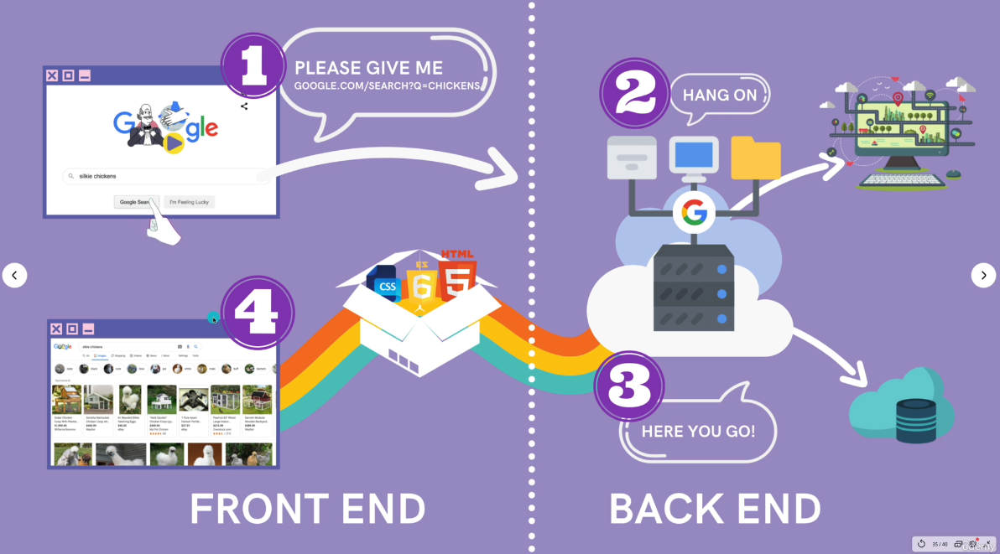
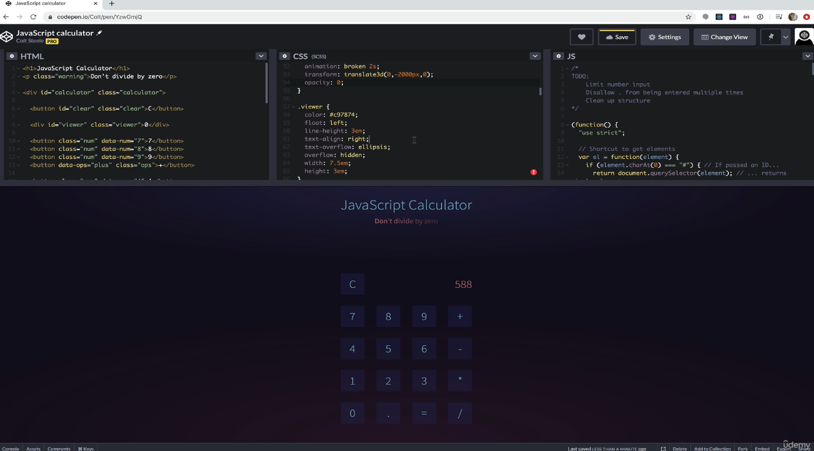
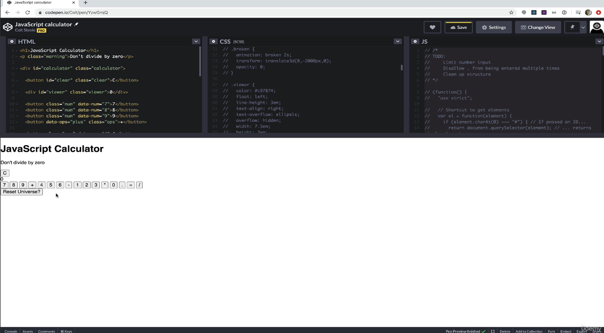
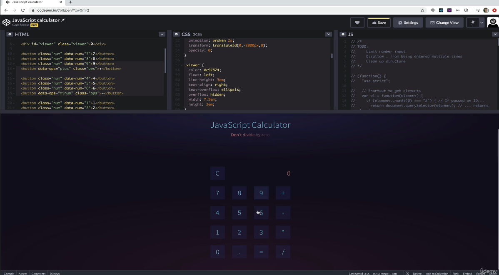
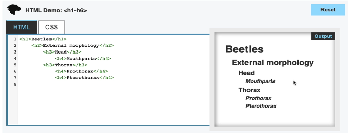

# Introduction

The internet is a network of networks.

The web, www, is an information system where we can share resources over the internet. The documents are identified by urls, uniform resource locator.

Web browser allow to view and request resources on the web.

The information is transferred using a protocol called HTTP, hyper-text-transfer protocol. It is the foundation of how the www works. It is a standardized set of rules of how the communication works.

server is a machine whose job is to satisfy requests. The server responds with instructions with code which the browser can understand and then display it.

The browsers job is to render content. HTML, CSS and javascript are the core technologies which every web page is made of and browser understands.

Backend code can be written in any language. Front end max 3 - HTML, CSS, Javascript.



## What do HTML/CSS/JS do?
These are the only things which the browser understands. Each have a different responsibility.

- HTML describes the things on the page i.e. nouns
- CSS describes the HTML elements on the page i.e. adjectives
- Javascript - things which it is doing i.e. verbs


With all turned on:



With only HTML turned on:



Adding CSS - but wont be able to do any math. That will be enabled by adding JS:



[Calculator link](https://codepen.io/giana/pen/GJMBEv)

## HTML Essentials
hyper-text-markup language. it is not a programming language. It is a language/syntax which we use to mark up documents/web pages.

HTML takes simple text and marks it up with some structure such that it can structure it into any format i.e. convert it into bold, bullet point, next para, indent, link etc. for the browser.

To write HTML we use HTML elements. We create elements by writing tags. Most elements consist of opening and closing tag.

```html
<p>I am a paragraph</p>
```

p+tab auto-completes the element. To create a file, end it with `.html` and open it in the browser.

In html, paragraph is anything we want to group together, images, text etc.

### \<h1-6>
